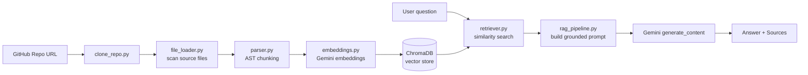

# 💻 GitHub Code Chatter
 
An AI-powered RAG (Retrieval-Augmented Generation) app that lets you **chat with any public GitHub repository**. Paste a repo URL, and it clones the code, parses it into structured chunks, embeds those chunks with Gemini, stores them in a local ChromaDB vector store, and answers your questions about the codebase — grounded in the actual source, with file/line citations.
 
---
 
## ✨ Features
 
- **Clone & index any public GitHub repo** from a URL, straight from the UI.
- **AST-based Python parsing** — chunks are extracted at the function/class level, not just split by line count, so retrieved context is coherent.
- **Resumable ingestion** — already-embedded chunks are skipped on re-index, so re-running on the same repo is fast and won't burn API quota.
- **Rate-limit aware embedding** — batches requests and backs off automatically on `429` quota errors instead of crashing.
- **Grounded answers with citations** — the LLM is instructed to answer only from retrieved code, and cites exact file paths and line ranges.
- **Graceful degradation** — if Gemini's generation API is temporarily overloaded (`503`), you still get the raw retrieved code back instead of a hard failure.
---
 
## 🏗️ Architecture
 

 
| Stage | Module | Responsibility |
|---|---|---|
| Ingestion | `backend/clone_repo.py` | Clones the repo into a temp directory |
| Ingestion | `backend/file_loader.py` | Scans for supported source files |
| Ingestion | `backend/parser.py` | AST-parses Python files into code chunks |
| Ingestion | `backend/embeddings.py` | Generates Gemini embeddings (`gemini-embedding-001`) |
| Ingestion | `backend/vector_store.py` | Stores/queries chunks in a persistent ChromaDB collection |
| Ingestion | `backend/ingest.py` | Orchestrates the full pipeline above (`ingest_repository`) |
| Retrieval + Generation | `backend/retriever.py` | Embeds the user's question and retrieves top-k relevant chunks |
| Retrieval + Generation | `backend/rag_pipeline.py` | Builds the grounded prompt and calls Gemini for the final answer |
| UI | `app.py` | Streamlit interface tying it all together |
 
> **Current limitation:** `file_loader.py` detects Python, JavaScript, TypeScript, Java, C/C++, Go, and Rust files, but `ingest.py` currently only parses **Python** files into chunks via `parser.py`. Multi-language chunking support is on the roadmap.
 
---
 
## 🛠️ Setup
 
### 1. Clone and create a virtual environment
 
```bash
git clone https://github.com/Fb-JAYRAJ/Github-Code-Chatter.git
cd Github-Code-Chatter
python -m venv venv
source venv/bin/activate      # Windows: venv\Scripts\activate
```
 
### 2. Install dependencies
 
```bash
pip install -r requirements.txt
```
 
### 3. Configure your Gemini API key
 
The app uses a single environment variable — `GEMINI_API_KEY` — for both embeddings and generation. Get a key from [Google AI Studio](https://aistudio.google.com/apikey), then create a `.env` file in the project root:
 
```
GEMINI_API_KEY=your_key_here
```
 
Or export it directly in your shell:
 
- **Mac/Linux:** `export GEMINI_API_KEY="your_key_here"`
- **Windows (PowerShell):** `$env:GEMINI_API_KEY="your_key_here"`
- **Windows (CMD):** `set GEMINI_API_KEY="your_key_here"`
> ⚠️ Never commit your `.env` file — make sure it's in `.gitignore`.
 
### 4. Run the app
 
```bash
streamlit run app.py
```
 
This opens the app at `http://localhost:8501`.
 
---
 
## 🚀 Usage
 
1. Paste a **public GitHub repository URL** into the sidebar under **Repository Setup**.
2. Click **Index Repository** — this clones, parses, embeds, and stores the codebase in ChromaDB. First-time indexing of a large repo may take a few minutes due to Gemini's embedding rate limits; re-indexing the same repo is near-instant since already-embedded chunks are skipped.
3. Once indexing completes, ask questions in the chat box — e.g. *"How does the ingestion pipeline work?"* or *"Where is rate limiting handled?"*
4. Each answer includes a **View Source Files** expander showing the exact files and line ranges the answer is grounded in.
---
 
## 📁 Project Structure
 
```
Github-Code-Chatter/
├── app.py                     # Streamlit entry point
├── backend/
│   ├── clone_repo.py          # Git cloning
│   ├── file_loader.py         # Source file discovery
│   ├── parser.py              # AST-based Python chunking
│   ├── embeddings.py          # Gemini embedding wrapper
│   ├── vector_store.py        # ChromaDB persistence layer
│   ├── ingest.py              # Full ingestion orchestration
│   ├── retriever.py           # Query embedding + similarity search
│   ├── rag_pipeline.py        # Prompt building + Gemini generation
│   └── metadata.py
├── frontend/                  # Earlier LangChain-based prototype (superseded by rag_pipeline.py)
├── prompts/
├── requirements.txt
└── test_backend.py
```
 
---
 
## 🧰 Tech Stack
 
- **UI:** Streamlit
- **LLM & Embeddings:** Google Gemini (`google-genai` SDK)
- **Vector Store:** ChromaDB (persisted locally in `database/chroma_db`)
- **Parsing:** Python `ast` module
- **Cloning:** GitPython
---
 
## 🤝 Contributing
 
1. **Fork and clone your fork**
```bash
   git clone https://github.com/YOUR-USERNAME/YOUR-FORKED-REPO.git
   cd YOUR-FORKED-REPO
```
 
2. **Add the original repository as `upstream`**
```bash
   git remote add upstream https://github.com/Fb-JAYRAJ/Github-Code-Chatter.git
```
 
3. **Sync your local `main` with upstream**
```bash
   git checkout main
   git fetch upstream
   git reset --hard upstream/main
```
 
4. **Create a feature branch**
```bash
   git checkout -b my-feature-branch
```
 
5. **Make your changes, then stage and commit**
```bash
   git add .
   git commit -m "Description of changes"
```
 
6. **Push your branch to your fork**
```bash
   git push origin my-feature-branch
```
 
7. **Open a Pull Request**
```bash
   gh pr create --repo Fb-JAYRAJ/Github-Code-Chatter --base main --head YOUR-USERNAME:my-feature-branch --title "Your PR Title" --body "Your PR description"
```
 
---
 
## 📌 Known Limitations
 
- Only Python source files are chunked/indexed today, even though other languages are detected during file scanning.
- The vector store currently keys chunks under a single shared collection — indexing a second, different repository without clearing `database/chroma_db` first will mix results from both repos.
- Repository indexing is in-memory per session; restarting the Streamlit app clears `is_indexed` state (though the underlying ChromaDB data persists on disk).